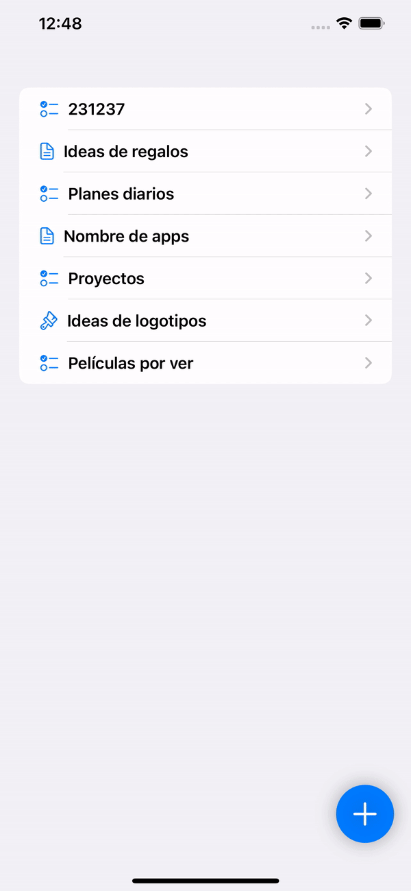
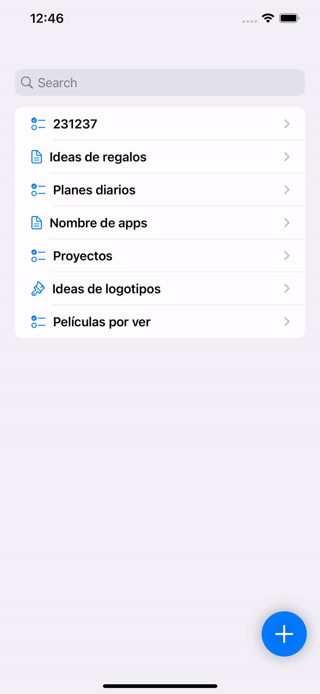
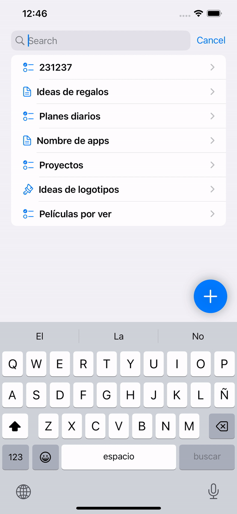
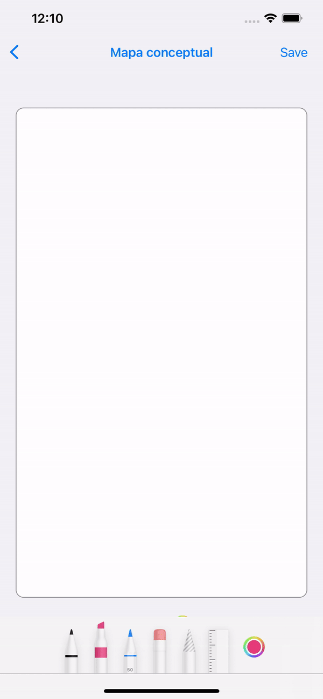
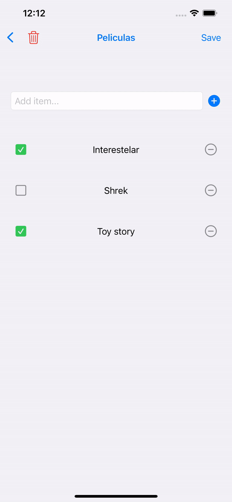
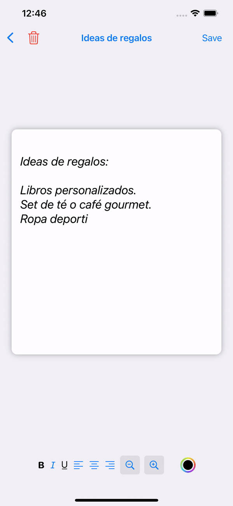
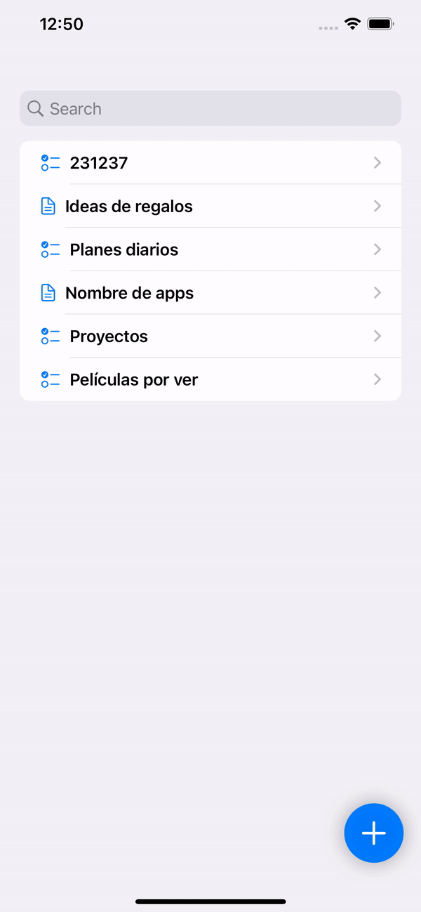
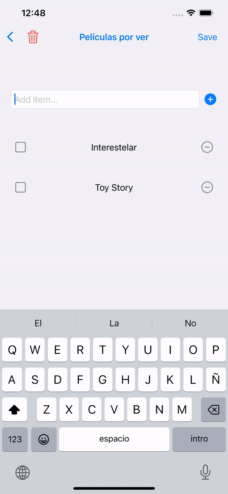

# Notes App

## Description

**Notes App** is an intuitive and versatile application that allows users to create, read, edit, and delete notes in various formats. The application supports:
- **Text**: Simple notes with style customization.
- **Checklists**: Task or to-do lists.
- **Drawings**: Visual notes using drawing tools.

The app uses:
- **PencilKit** for drawing functionality.
- **UserDefaults** for efficient data storage and management.
- **UIColor** for text color customization.

## Features

1. **Note Management**: Easily create, edit, read, and delete notes.
2. **Customization**: Adjust the style of your notes with options for:
   - Font size.
   - Text color.
   - Styles such as bold, italic, and underline.
   - Text alignment (left, center, or right).
3. **Drawing**: Create visual notes with drawing tools powered by PencilKit.
4. **Checklists**: Organize tasks and mark completed ones.

## Data Model

The main data structure used in the application is:

```swift
struct Note: Identifiable, Codable {
    var id: UUID
    var title: String
    var content: String
    var type: NoteType
    var checklistItems: [ChecklistItem]? 
    var drawingData: Data?
    var fontSize: CGFloat
    var textColor: String
    var isBold: Bool
    var isItalic: Bool
    var isUnderlined: Bool
    var textAlignment: TextAlignmentWrapper?

    enum NoteType: String, Codable {
        case text
        case checklist
        case drawing
    }

    enum CodingKeys: String, CodingKey {
        case id
        case title
        case content
        case type
        case checklistItems
        case drawingData
        case fontSize
        case textColor
        case isBold
        case isItalic
        case isUnderlined
        case textAlignment
    }
}

```

## Dependencies

- **PencilKit**: For implementing drawing tools.
- **UserDefaults**: For storing notes locally and persistently.
- **UIKit**: For text color and alignment customization.

## Installation

1. Clone this repository to your local machine.
2. Open the project in Xcode.
3. Build and run the application on a simulator or physical iOS device.

## Usage

1. **Create Notes**: Select the note type (Text, Checklist, or Drawing).
2. **Edit Notes**: Customize your notes by changing their color, font, or style.
3. **Organization**: View all your notes in a list and manage their content.
4. **Draw**: Use PencilKit tools to create graphical ideas.


---
<p align="center">
   
   
   
</p>
<p align="center">
   
   
   
</p>
<p align="center">
   
   
</p>


